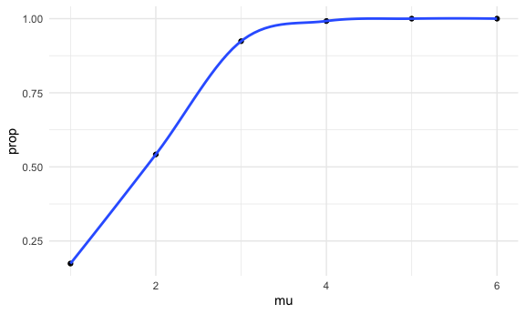

p8105_hw5_nec2159
================
Nicole Criscuolo
2025-10-30

## Problem 1

``` r
bday_function = function(n) {
  
  birthdays = sample(1:365, n, replace = TRUE)
  
  repeated_bday = length(unique(birthdays)) < n
  
  repeated_bday
  
}
```

``` r
bday_sim =
  expand_grid(
    bdays = 2:50,
    iter = 1:10000
  ) |> 
    mutate(
    result = map_lgl(bdays, bday_function)
  ) |> 
  group_by(bdays) |> 
  summarize(
  prob_repeat = mean(result)
  )
```

``` r
bday_sim |> 
ggplot(aes(x = bdays, y = prob_repeat)) +
  geom_point() +
  geom_line() +
  labs(
    x = "Number of Birthdays",
    y = "Probability of at least one repeated birthday",
    title = "Probability of Repeat Birthdays"
  )
```


## Problem 2

``` r
power_function = function(n = 30, mu, sigma = 5) {
  
  x = rnorm(n = n, mean = mu, sd = sigma)
  
  t.test(x) |> 
    broom::tidy()
  
}
```

``` r
output = vector("list", length = 500)

for (i in 1:500) {
  
  output[[i]] = power_function(mu = 0)

}
```

``` r
power_df =
  expand_grid(
    iter = 1:500,
    mu = 1:6
    ) |> 
  mutate(
    results = map(mu, \(mu) power_function(mu = mu))
    ) |> 
  unnest(results)
```

``` r
power_df |> 
  group_by(mu) |> 
  summarize(
    prop_reject = mean(p.value < .05)
  ) |> 
  ggplot(aes(x = mu, y = prop_reject)) +
  geom_point() +
  geom_smooth(se = FALSE) +
  labs(
    x = "True Mean",
    y = "Proportion of Rejections",
    title = "Proportion of Times Null was Rejected for Each True Mean"
  )
```

    ## `geom_smooth()` using method = 'loess' and formula = 'y ~ x'



``` r
power_df |> 
  group_by(mu) |> 
  mutate(avg_estimate = mean(estimate)) |> 
  ggplot(aes(x = mu, y = avg_estimate)) +
  geom_point() +
  geom_line() +
  labs(
    x = "True Mean",
    y = "Average Estimate",
    title = "Average Mean Estimate Compared to True Mean"
  )
```


``` r
power_df |> 
  filter(p.value < .05) |> 
  group_by(mu) |> 
  mutate(avg_estimate = mean(estimate)) |>
  ggplot(aes(x = mu, y = avg_estimate)) +
  geom_point() +
  geom_line() +
  labs(
    x = "True Mean",
    y = "Average Estimate",
    title = "Average Mean Estimate Compared to True Mean in\nSamples where Null was Rejected"
  )
```


## Problem 3

``` r
homicide_df =
  read_csv("data/homicide-data.csv") |> 
  mutate(city_state = paste(city, state, sep = ", ")) |> 
  group_by(city_state) |> 
  summarize(
    all_homicides = n(),
    unsolved_homicides = sum(disposition %in% c("Closed without arrest", "Open/No arrest"))
    )
```

    ## Rows: 52179 Columns: 12
    ## ── Column specification ────────────────────────────────────────────────────────
    ## Delimiter: ","
    ## chr (9): uid, victim_last, victim_first, victim_race, victim_age, victim_sex...
    ## dbl (3): reported_date, lat, lon
    ## 
    ## ℹ Use `spec()` to retrieve the full column specification for this data.
    ## ℹ Specify the column types or set `show_col_types = FALSE` to quiet this message.

``` r
baltimore_test =
homicide_df |> 
  filter(city_state == "Baltimore, MD") |> 
  with(prop.test(x = unsolved_homicides, n = all_homicides)) |> 
  broom::tidy() |> 
  select(estimate, conf.low, conf.high)

baltimore_test
```

    ## # A tibble: 1 × 3
    ##   estimate conf.low conf.high
    ##      <dbl>    <dbl>     <dbl>
    ## 1    0.646    0.628     0.663

``` r
prop_test = function(df) {
  
    prop.test(x = df$unsolved_homicides, n = df$all_homicides)

}
```

``` r
nested_test_results =
homicide_df |> 
  nest(data = -city_state) |> 
  mutate(
    test = map(data, prop_test),
    results = map(test, broom::tidy)
  ) |> 
  unnest(results) |> 
  select(city_state, estimate, conf.low, conf.high)
```

    ## Warning: There was 1 warning in `mutate()`.
    ## ℹ In argument: `test = map(data, prop_test)`.
    ## Caused by warning in `prop.test()`:
    ## ! Chi-squared approximation may be incorrect

``` r
nested_test_results |> 
  mutate(city_state = reorder(city_state, estimate)) |> 
  ggplot(aes(x = city_state, y = estimate)) +
  geom_point(size = .5) +
  geom_errorbar(aes(ymin = conf.low, ymax = conf.high)) +
  theme(axis.text.x = element_text(angle = 90, hjust = 1))
```


``` r
test_results =
homicide_df |> 
  mutate(
    test = map2(unsolved_homicides, all_homicides, prop.test),
    results = map(test, broom::tidy)
  ) |> 
  unnest(results) |> 
  select(city_state, estimate, conf.low, conf.high)
```

    ## Warning: There was 1 warning in `mutate()`.
    ## ℹ In argument: `test = map2(unsolved_homicides, all_homicides, prop.test)`.
    ## Caused by warning in `.f()`:
    ## ! Chi-squared approximation may be incorrect

``` r
test_results |> 
  mutate(city_state = reorder(city_state, estimate)) |> 
  ggplot(aes(x = city_state, y = estimate)) +
  geom_point(size = .5) +
  geom_errorbar(aes(ymin = conf.low, ymax = conf.high)) +
  theme(axis.text.x = element_text(angle = 90, hjust = 1))
```


# REMINDER: CHANGE ITERATION FOR PROBLEM 2
