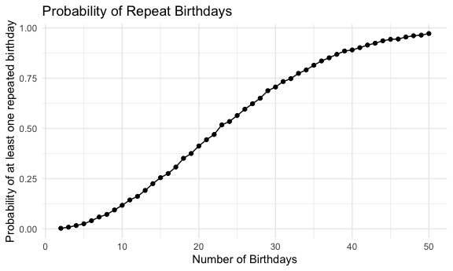

p8105_hw5_nec2159
================
Nicole Criscuolo
2025-10-30

## Problem 1

``` r
bday_function = function(n) {
  
  birthdays = sample(1:365, n, replace = TRUE)
  
  repeated_bday = length(unique(birthdays)) < n
  
  repeated_bday
  
}
```

``` r
bday_sim =
  expand_grid(
    bdays = 2:50,
    iter = 1:10000
  ) |> 
    mutate(
    result = map_lgl(bdays, bday_function)
  ) |> 
  group_by(bdays) |> 
  summarize(
  prob_repeat = mean(result)
  )
```

``` r
bday_sim |> 
ggplot(aes(x = bdays, y = prob_repeat)) +
  geom_point() +
  geom_line() +
  labs(
    x = "Number of Birthdays",
    y = "Probability of at least one repeated birthday",
    title = "Probability of Repeat Birthdays"
  )
```



## Problem 2

``` r
power_function = function(n = 30, mu, sigma = 5) {
  
  x = rnorm(n = n, mean = mu, sd = sigma)
  
  t.test(x) |> 
    broom::tidy() |> 
    select(estimate, p.value)
  
}
```

``` r
output = vector("list", length = 500)

for (i in 1:500) {
  
  output[[i]] = power_function(mu = 0)

}
```

``` r
power_df =
  expand_grid(
    iter = 1:500,
    mu = 0:6
    ) |> 
  mutate(
    results = map2(iter, mu, \(i, m) power_function(mu = m))
    ) |> 
  unnest(results)
```

``` r
power_df |> 
  group_by(mu) |> 
  summarize(
    prop_reject = mean(p.value < .05)
  ) |> 
  ggplot(aes(x = mu, y = prop_reject)) +
  geom_point() +
  geom_smooth(se = FALSE) +
  labs(
    x = "True Mean",
    y = "Proportion of Rejections",
    title = "Proportion of Times Null was Rejected for Each True Mean"
  )
```

    ## `geom_smooth()` using method = 'loess' and formula = 'y ~ x'


When the true mean is 0, the graph shows that we reject the null (𝐻:𝜇=
0) about 5% of the time. This is what we would expect given alpha is
.05, representing the false positive/ type I error rate as we are
rejecting the null when the null is actually true. When the true mean is
greater than 0 (so we know the null is false), the proportion of
rejections represents the power, which is the probability that the null
is rejected given that the null is false. As the true mean increases,
power increases as well as it becomes easier to reject the null as the
true mean deviates further from 0. Along the same lines, since the
formula for effect size depends on the difference between the sample
mean and the true mean, we can conclude that the effect size increases
with both power and the population mean.

``` r
power_df |> 
  group_by(mu) |> 
  mutate(avg_estimate = mean(estimate)) |> 
  ggplot(aes(x = mu, y = avg_estimate)) +
  geom_point() +
  geom_line() +
  labs(
    x = "True Mean",
    y = "Average Mean Estimate",
    title = "Average Mean Estimate Compared to True Mean"
  )
```


We can see the average mean estimates are approximately equal to the
true mean. Since our sample size is relatively large (n = 30), each mean
estimate is relatively precise. Additionally, taking the average of the
mean estimates across thousands of iterations gives us a precise and
accurate measure of the true mean since the sample mean is an unbiased
estimator of the population mean.

``` r
power_df |> 
  filter(p.value < .05) |> 
  group_by(mu) |> 
  mutate(avg_estimate = mean(estimate)) |>
  ggplot(aes(x = mu, y = avg_estimate)) +
  geom_point() +
  geom_line() +
  labs(
    x = "True Mean",
    y = "Average Mean Estimate",
    title = "Average Mean Estimate Compared to True Mean in\nSamples where Null was Rejected"
  )
```


In this case, the average mean estimates are approximately equal to the
true mean only for the larger population means. When the true mean is
closer to 0, the estimates are also going to be closer to 0 on average.
Since we are only looking at the average mean estimates in cases where
the null was rejected, we are looking at the average of the (few) cases
where the estimates were large enough to conclude that the true mean
isn’t actually 0 (which is also why the average estimates are larger
than the true mean). This is not aligned with the true mean because all
of the estimates that were close to 1, 2, or 3 got filtered out since
the null wasn’t rejected in those cases. As the true mean increases, the
average mean estimates also increase on average. Therefore, the cases
where the null gets rejected here are more aligned with the true mean
because estimates close to 4, 5, and 6 are almost always rejected and
are taken into account in the averages.

## Problem 3

``` r
homicide_df =
  read_csv("data/homicide-data.csv") |> 
  mutate(city_state = paste(city, state, sep = ", ")) |> 
  group_by(city_state) |> 
  summarize(
    all_homicides = n(),
    unsolved_homicides = sum(disposition %in% c("Closed without arrest", "Open/No arrest"))
    )
```

    ## Rows: 52179 Columns: 12
    ## ── Column specification ────────────────────────────────────────────────────────
    ## Delimiter: ","
    ## chr (9): uid, victim_last, victim_first, victim_race, victim_age, victim_sex...
    ## dbl (3): reported_date, lat, lon
    ## 
    ## ℹ Use `spec()` to retrieve the full column specification for this data.
    ## ℹ Specify the column types or set `show_col_types = FALSE` to quiet this message.

``` r
baltimore_test =
homicide_df |> 
  filter(city_state == "Baltimore, MD") |> 
  with(prop.test(x = unsolved_homicides, n = all_homicides)) |> 
  broom::tidy() |> 
  select(estimate, conf.low, conf.high)

baltimore_test
```

    ## # A tibble: 1 × 3
    ##   estimate conf.low conf.high
    ##      <dbl>    <dbl>     <dbl>
    ## 1    0.646    0.628     0.663

``` r
prop_test = function(df) {
  
    prop.test(x = df$unsolved_homicides, n = df$all_homicides)

}
```

``` r
nested_test_results =
homicide_df |> 
  nest(data = -city_state) |> 
  mutate(
    test = map(data, prop_test),
    results = map(test, broom::tidy)
  ) |> 
  unnest(results) |> 
  select(city_state, estimate, conf.low, conf.high)
```

    ## Warning: There was 1 warning in `mutate()`.
    ## ℹ In argument: `test = map(data, prop_test)`.
    ## Caused by warning in `prop.test()`:
    ## ! Chi-squared approximation may be incorrect

``` r
nested_test_results |> 
  mutate(city_state = reorder(city_state, estimate)) |> 
  ggplot(aes(x = city_state, y = estimate)) +
  geom_point(size = .5) +
  geom_errorbar(aes(ymin = conf.low, ymax = conf.high)) +
  theme(axis.text.x = element_text(angle = 90, hjust = 1))
```


``` r
test_results =
homicide_df |> 
  mutate(
    test = map2(unsolved_homicides, all_homicides, prop.test),
    results = map(test, broom::tidy)
  ) |> 
  unnest(results) |> 
  select(city_state, estimate, conf.low, conf.high)
```

    ## Warning: There was 1 warning in `mutate()`.
    ## ℹ In argument: `test = map2(unsolved_homicides, all_homicides, prop.test)`.
    ## Caused by warning in `.f()`:
    ## ! Chi-squared approximation may be incorrect

``` r
test_results |> 
  mutate(city_state = reorder(city_state, estimate)) |> 
  ggplot(aes(x = city_state, y = estimate)) +
  geom_point(size = .5) +
  geom_errorbar(aes(ymin = conf.low, ymax = conf.high)) +
  theme(axis.text.x = element_text(angle = 90, hjust = 1))
```


# REMINDER: CHANGE ITERATION FOR PROBLEM 2
